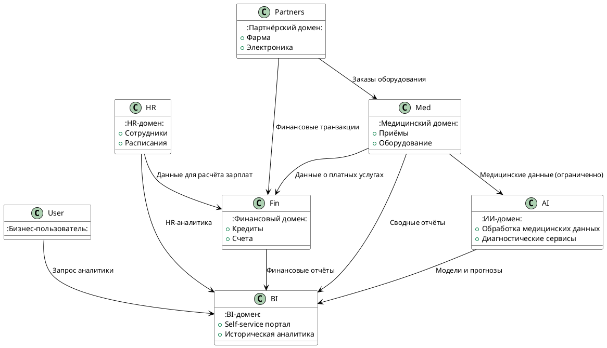

# Task 2 — Разделение системы на домены и потоки данных

## 🧩 Цель

Предложить доменное разделение архитектуры компании «Будущее 2.0» с учётом возможности **независимого развития каждого направления**, **снижения зависимости от DWH** и **гибкой интеграции новых бизнесов**.  
Также необходимо **визуализировать потоки данных** между доменами и ключевыми компонентами с помощью **Data Flow Diagram (DFD)**.

---

## 🧱 Предложенные домены

### 1. **Медицинский домен**
- Клинические записи (без истории болезней и медицинских исследований)
- Данные по приёму пациентов
- Инвентаризация оборудования
- Работа клиник

### 2. **ИИ-домен**
- Обработка медицинских данных и обучение моделей
- Сервисы диагностики на базе ИИ
- Интеграция с медицинским доменом через контролируемый API

### 3. **Финансовый домен**
- Банковские счета
- Кредитная история
- Платёжные сервисы
- Интеграция с HR и Медицинским доменом (для выставления счетов)

### 4. **HR-домен**
- Персональные данные сотрудников
- Расписания, смены
- Производственные KPI и метрики

### 5. **Бизнес-аналитика (BI-домен)**
- Консолидированные витрины данных
- Self-service аналитика
- Исторические данные, отчёты и дешборды

### 6. **Партнёрский домен**
- Новые бизнесы (фармацевтика, электроника)
- Интеграция через стандартизированные API
- Обмен метаданными, статистикой, заказами

---

## 📌 Логика разделения

- Домены сформированы по **бизнес-направлениям**, а не по структуре текущих таблиц.
- Каждому домену можно выделить **отдельную команду**, которая будет развивать его независимо.
- **Интеграция между доменами** осуществляется через стандартизированные **события и API** (Event-driven подход), а не через общий DWH.
- Каждый домен может использовать **своё хранилище** (например, Data Lake-подраздел или Postgres), и публиковать агрегированные данные в BI-домен.

---

## 🔄 Data Flow Diagram (DFD)

---

## ✅ Преимущества предложенного разделения

- **Гибкость:** Каждое направление (медицина, финансы, ИИ и др.) развивается независимо, без влияния на другие.
- **Масштабируемость:** Новые команды могут работать параллельно, подключение новых бизнесов упрощается.
- **Снижение зависимости от DWH:** Постепенная миграция логики в сервисы, отказ от монолита.
- **Прозрачность:** BI получает чистые и агрегированные данные от каждого домена, упрощая отчётность.
- **Безопасность:** Разделение данных позволяет гибко управлять доступом и соответствовать нормативам.
- **Ускорение Time-to-Market:** Новые отчёты и фичи можно разрабатывать быстрее, не блокируя другие направления.

---

## 🔚 Вывод

Такое доменное разделение делает архитектуру устойчивой, гибкой и готовой к дальнейшему росту.  
Оно снижает технический долг, минимизирует перекрёстные зависимости и облегчает масштабирование команд и бизнесов.
